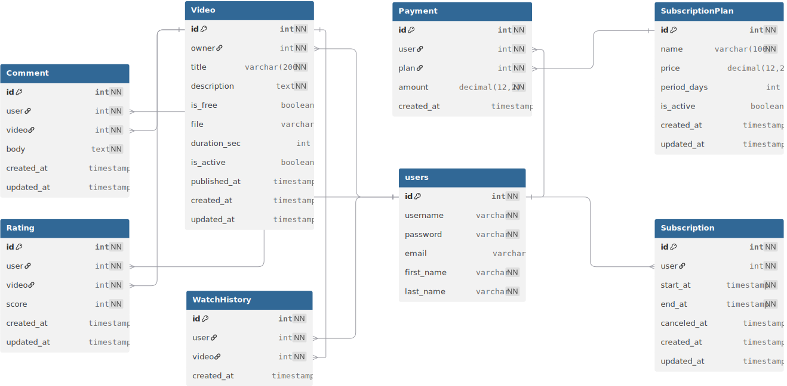

# 🎬 Video Subscription API

A minimal **Django REST Framework** project for managing video subscriptions, user accounts, and payments — designed as a simplified OTT (video-on-demand) backend.

---

## 🚀 Features

- 🔐 **User management** — registration, login, logout, JWT tokens  
- 🎥 **Video management** — upload, list, comment, rate  
- 💳 **Subscription & Payment** — purchase and renewal (mock payments)  
- 🧾 **User activity tracking** — watch logs, ratings, comments  
- ⚙️ **RESTful API** with role-based permissions  
- 📅 **Clean data model and ER diagram**

---

## 🧩 Tech Stack

- **Python 3.11+**
- **Django 5.x**
- **Django REST Framework**
- **Simple JWT** (authentication)
- **SQLite** (default; easily switchable to PostgreSQL)

---

## 🧱 Data Model

Below is the ER diagram representing the core entities and their relations:



> ERD generated with [dbdiagram.io](https://dbdiagram.io)

**Main Entities:**
- `User` — built-in Django user model for authentication  
- `Video` — video metadata and file upload  
- `SubscriptionPlan` — defines price and duration  
- `Subscription` — user’s active period (start–end)  
- `Payment` — mock transaction handler and subscription applier  
- `ViewLog`, `Rating`, `Comment` — user activity records  

---

## ⚙️ Setup & Run Locally

```bash
git clone https://github.com/<your-username>/<repo-name>.git
cd <repo-name>

# optional: create virtual environment
python -m venv venv
source venv/bin/activate   # on Windows: venv\Scripts\activate

pip install -r requirements.txt
python manage.py migrate
python manage.py createsuperuser
python manage.py runserver
```

Then open:  
👉 http://127.0.0.1:8000/api/v1/

---

## 🔑 Authentication Endpoints

| Action | Method | Endpoint |
|--------|---------|----------|
| Register | `POST` | `/api/v1/accounts/register/` |
| Login | `POST` | `/api/v1/accounts/login/` |
| Logout | `POST` | `/api/v1/accounts/logout/` |
| Refresh Token | `POST` | `/api/v1/accounts/token/refresh/` |
| Profile | `GET/PATCH` | `/api/v1/accounts/me/` |
| Change Password | `POST` | `/api/v1/accounts/change-password/` |

---

## 💳 Subscription & Payment API

| Action | Method | Endpoint | Auth |
|--------|---------|----------|------|
| List available plans | `GET` | `/api/v1/subscriptions/plans/` | Public |
| My active subscription | `GET` | `/api/v1/subscriptions/my/` | ✅ |
| Cancel subscription | `POST` | `/api/v1/subscriptions/cancel/` | ✅ |
| Buy or renew plan | `POST` | `/api/v1/payments/` | ✅ |
| My payment history | `GET` | `/api/v1/payments/my/` | ✅ |

---

## 🎥 Videos & Activity API

| Action | Method | Endpoint | Auth |
|--------|---------|----------|------|
| List all videos | `GET` | `/api/v1/videos/` | Public |
| Watch a video (log view) | `POST` | `/api/v1/activities/watch/` | ✅ |
| My watch history | `GET` | `/api/v1/activities/my/` | ✅ |
| Rate a video | `POST` | `/api/v1/activities/ratings/` | ✅ |
| Comment a video | `POST` | `/api/v1/activities/comments/` | ✅ |

---

## 🧠 Business Logic Summary

- Only **admins** can upload videos.  
- **Free videos** are accessible to everyone.  
- **Subscriber-only videos** require an active subscription.  
- Each user can have **only one active subscription** at a time.  
- Renewals are allowed only within a **30-day window** before expiration.  
- **Ratings:** one per user/video — re-rating overwrites the previous one.  
- **Comments:** multiple allowed per user/video.  
- **Payments:** simulated (no real gateway).  

---

## 📂 Folder Structure

```
video_subscription/
│
├── core/                  # global project configuration
├── accounts/              # user registration, auth, profile
├── videos/                # upload and list videos
├── subscriptions/         # plans + active subscription
├── payments/              # mock payment + renewal logic
├── activities/            # views, ratings, comments
│
├── docs/erd.svg           # data model diagram
├── requirements.txt
├── README.md
└── .gitignore
```

---

## 🧩 Example Workflow

1. User registers and logs in → receives JWT tokens  
2. User views available plans → selects one and sends payment request  
3. Payment creates or extends subscription  
4. User watches videos (free or subscriber-only)  
5. User can comment or rate videos they have watched  
6. Renewal is allowed only within the defined window (30 days)

---

## 🧰 Environment & Configuration Notes

- Default database: **SQLite3**  
- Uploaded videos stored under `/media/videos/`  
- Token lifetime configured in `SIMPLE_JWT` (settings.py)  
- All endpoints are versioned under `/api/v1/`  
- Permissions strictly enforced based on authentication and role  

---

## 📝 License

[MIT License](LICENSE)

---

### ✨ Author’s Note

This project was built as a **learning-oriented, minimal backend** for video subscription logic using Django REST Framework.  
Feel free to fork, extend, and experiment (e.g., add a real payment gateway, search, playlists, or user notifications).

---

⭐ **If you like this project, give it a star on GitHub!**
